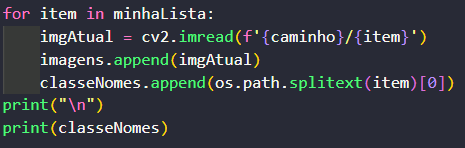

<h1 align="center">UNIP - Universidade Paulista</h1>

<h2 align="center">Ciência da Computação (CC)</h2>

<h2 align="center">DESENVOLVIMENTO DE UM SISTEMA COMPUTACIONAL PARA ANÁLISE E CLASSIFICAÇÃO DE FORMAS</h2>

Link do github: https://github.com/dudushy/aps6semestre2021
 

Disciplina: Processamento de Imagem
 

Prof. Fabricio Henrique
 

Integrantes:

Nome | RA
--- | ---
Guilherme Altobeli Crespo | N44567-0
Yan Falcão Callegaris | N4889C-9
Klaus Weber Batista Rodrigues | F1265B-3
Eduardo Talarico de Paula | N3881A-0
Matheus Rocha | N415DC-1

---
### Índice

- [Objetivo do Trabalho](#objetivo-do-trabalho)
 

- [Introdução](#introdução)
 

- [Referencial Teórico](#referencial-teórico)
 

- [Plano de desenvolvimento da aplicação](#plano-de-desenvolvimento-da-aplicação)
 

- [Projeto (estrutura) do programa](#projeto-estrutura-do-programa)
 

- [Relatório com as linhas de código](#relatório-com-as-linhas-de-código)
 

- [Fonte Bibliografica e Link do projeto](#fonte-bibliografica-e-link-do-projeto)

---
## Objetivo do Trabalho

Hoje no mercado de trabalho da programação já acabou aquela visão de que o programador ficava o dia inteiro sentado na frente de um computador sem ter contato com pessoas e isolado do mundo lá fora com apenas paredes em sua volta, hoje o programador trabalha em grupos ou em coworkings com espaços abertos e várias pessoas para conversar e trocar ideias.
 

O objetivo deste trabalho não é apenas sentar na frente de seu notebook, ligar o spotify e codificar, mas sim ter um aprendizado em grupo discutindo várias ideias e hipóteses para que quando nos formarmos já termos essas experiências de trabalhar sempre em conjunto com pessoas, pois, assim como a tecnologia sempre está mudando, precisamos mudar também para não virarmos dinossauros.
 

O objetivo do trabalho é criar uma ferramenta computacional para análise e classificação de formas a partir de imagem, ou seja, um programa que reconheça padrões dentro de uma imagem e consiga nos retornar uma informação útil a partir dela. Decidimos fazer um programa para estipular a idade da pessoa com base no seu rosto.
 

Esse tipo de software pode ser usado para várias coisas como, por exemplo, pode ser usado para identificar doenças em algum tipo de exame que gere imagens, outro exemplo é saber o sexo da pessoa, a emoção que ela está sentindo, entre outros vários softwares de reconhecimento.
 

Para realizarmos o projeto usamos algumas ferramentas que facilitam o nosso trabalho, nosso programa utiliza a linguagem Python.
 

O Python foi criado no início dos anos 1990 por Guido van Rossum  na Holanda como o sucessor de uma linguagem chamada ABC.

---
## Introdução

Em um mundo cada vez mais interconectado, empresas e organizações de todos os portes e ramos de atividade perceberam a importância de manter uma presença online e investir nessa tarefa. No cenário atual, com inúmeros aplicativos e sites competindo pela atenção do público, ferramentas como o reconhecimento facial estão se tornando cada vez mais necessárias.
 

Por meio dele, os usuários de redes sociais podem obter informações úteis sobre o próprio perfil e a de pessoas ao seu redor, o que lhes permite a tecnologia a avançar em estratégias mais eficazes para usar a tecnologia de reconhecimento para que pessoas aplicar em outros aspectos e assuntos de segurança.
 

De forma simples, podemos descrever a tecnologia de reconhecimento facial como um algoritmo desenvolvido para verificar rostos de pessoas, buscar informações em bancos de dados de fotos onde você consegue cruzar informações de padrões para que possa estar verificando quem é a determinada pessoa.
 

Embora essa tecnologia possa parecer fora de alcance, pode-se dizer que faz parte de nossas vidas diárias. Afinal, desde que pesquisemos em plataformas como Google Fotos ou Adobe Photos, os rastreadores da tecnologia tomarão medidas e cálculos e filtrarão uma série de faces para garantir que o processo todo do reconhecimento seja concluído.
 

Além disso, o reconhecimento facial está mais presente que você pensa seu próprio celular tem o modo de desbloqueio de tela por reconhecimento facial.
Basicamente, o reconhecimento facial funciona fazendo um cálculo dos principais pontos do rosto como, olhos, boca, nariz a Internet, verificando cada medida e padrões de rostos em um banco de imagens criado pela biblioteca da aplicação.
 

Para realizarmos nosso trabalho utilizamos algumas bibliotecas do Python como  OpenCV, Face Recognition, Numpy e OS.
 

OpenCV é uma biblioteca Multiplataforma dedicada a projetos de visão computacional OpenCV possui módulos de Processamento de Imagens e Vídeo I/O, Estrutura de Dados, Álgebra Linear, GUI (Interface gráfica do usuário).
 

Face Recognition  é uma ferramenta de processamento de imagens onde ela faz o mapeamento da imagem no caso um rosto para que possa estar efetuando o cálculo de padrões onde é feito o encoding das imagens para reconhecimento facial.
 

NumPy é uma biblioteca de programação em linguagem python onde suporta um grande processamento de matrizes, arranjos e muitas funções matemáticas de alto nível de operação
(OS) é uma biblioteca padrão do Python onde é usada para operar todos os derivados dependentes do S.O (Sistema Operacional).
 

Utilizamos os melhores recursos encontrados para chegar ao resultado final de nossa APS onde criamos uma ferramenta que pode ser usado tanto para fazer o desbloqueio de seu smartphone tanto para fazer um reconhecimento facial forense, por exemplo.

---
## Referencial Teórico

A indústria de reconhecimento facial fez um progresso impressionante em pouco tempo e não só facial, mas classificação de formas também faz parte dessa evolução. Hoje, com aplicativos instalados no seu celular você consegue desbloquear eles só com o reconhecimento facial, e não só desbloquear, mas fazer várias funções que eles podem fazer com o reconhecimento facial ou de imagem.
 

O primeiro relato do desenvolvimento do reconhecimento facial foi em 1964.
Com um livro de fotos e uma fotografia de investigação, Bledsoe usou um programa de computador para cruzar a identidade do suspeito com outra no livro de fotos. Apesar de seu método ter se tornado popular, na época, ele era caro e lento em termos computacionais: o pesquisador conseguia processar somente 40 fotos por hora. Depois disso essa tecnologia foi evoluindo e evoluindo até chegar ao ponto que estamos hoje.
Uma parte disso é realizado pela manipulação de imagem, a manipulação de uma imagem por um computador, no qual se tem como entrada e saída uma imagem, é chamada de Processamento Digital de Imagens. O objetivo de se usar esse processamento é melhorar o aspecto visual das imagens possibilitando uma melhor interpretação, facilitando a extração de informações das mesmas.
 

Pessoas estão familiarizadas com o reconhecimento facial por causa do Face ID do Iphone, pois, ele usa o reconhecimento para desbloquear o celular, ele simplesmente a identifica e reconhece como sendo a proprietária única do dispositivo, limitando o acesso de outros. O Face ID garante autenticação intuitiva e segura e é ativado pelo sistema de câmera TrueDepth de última geração, que usa tecnologias avançadas para mapear a geometria do rosto com precisão.
 

As leis também podem usar o reconhecimento facial, e as agências de aplicação da lei em vários países estão usando cada vez mais a tecnologia. A polícia tirou fotos de prisioneiros da polícia e as comparou com imagens de bancos de dados de reconhecimento facial, estaduais e federais.
 

Assim que a foto do prisioneiro for tirada, ela será adicionada ao banco de dados para verificação quando a polícia fizer uma busca criminal.
 

O reconhecimento facial móvel permite que os funcionários usem smartphones, tablets ou outros dispositivos portáteis para tirar fotos de motoristas ou pedestres no local e imediatamente compará-los com outras fotos em um ou mais bancos de dados de reconhecimento facial para tentar identificar.
O reconhecimento facial ajuda a identificar terroristas ou outros criminosos, facilita o rastreamento de assaltantes, ladrões e invasores.
 

Para conseguir fazer um programa de reconhecimento facial além de utilizar o Python também utilizamos bibliotecas para nos ajudar no processo.
Uma dessas bibliotecas foi o OpenCV.
 

OpenCV é uma biblioteca de código aberto útil para aplicações de visão computacional, como análise de vídeo e análise de imagem. OpenCV é escrito em C ++ e possui mais de 2.500 algoritmos otimizados. Muito utilizado quando criamos aplicativos para visão computacional que não queremos construir do zero, podemos usar esta biblioteca para começar a nos concentrar nos problemas do mundo real. Existem muitas empresas que usam essa biblioteca hoje, como Google, Amazon, Microsoft e Toyota. Muitos pesquisadores e desenvolvedores contribuem. 
 

Outra biblioteca utilizada foi o Face Recognition, uma biblioteca capaz de reconhecer e manipular rostos em Python, uma biblioteca que consegue encontrar e distinguir rostos em uma imagem, podendo reconhecer um rosto colocar o nome da pessoa na imagem.
 

Obtenha a posição e o contorno dos olhos, nariz, boca e queixo de cada pessoa.
 

 

Agora com o nome de cada pessoa na imagem, nota se que mesmo de uma imagem do celular ele consegue reconhecer o Barack Obama.
 

 

Também utilizamos o NumPy, que é o pacote básico de computação científica em Python. É uma biblioteca Python que fornece objetos de matriz multidimensional, vários objetos derivados (como matrizes e matrizes mascaradas) e várias rotinas para realizar operações rápidas em matrizes, incluindo matemática, lógica, operações de forma, classificação, seleção. Discreta Transformada de Fourier, álgebra linear básica, operações estatísticas básicas, simulação aleatória, etc.
 

Tendo conhecimento de todas essas informações estávamos apto para conseguir fazer toda a nossa aps.

---
## Plano de desenvolvimento da aplicação

Trabalho em equipe é muito importante e essencial, pois, se a sua equipe não está satisfeita, eles não iram conseguir dar o máximo de si.
 

A primeira parte do nosso Plano de desenvolvimento foi fazermos uma reunião e discutir todas as ideias de todos os integrantes do grupo, primeiramente conversamos sobre o processamento de imagens em si, fazendo um levantamento de requisitos, como, por exemplo, o que deveria ser, o que poderíamos fazer, como poderíamos fazer, o que poderíamos usar de recursos, após termos uma ideia inicial decidimos que seria melhor dividir o nosso grupo em pequenas equipes, cada uma responsável pela entrega de algo no projeto, como, por exemplo, um grupo no desenvolvimento Python, para fazermos o código que processa as propriedades de uma imagem e utiliza as para algum outro processamento da mesma, enquanto outro grupo cuidava de todo o objetivo lógico do nosso objetivo estipulado.
 

Observando alguns vídeos de projetos semelhantes ao nosso objetivo e algumas páginas para fazermos o software, tivemos uma noção maior de como o trabalho seria feito.
 

Para fazermos o identificador facial, utilizamos a linguagem Python e algumas de suas bibliotecas. Mas antes algo que nos que deu uma boa ideia da onde começar, eram vários outros projetos já existentes que tratam imagem com objetivos diferentes, não utilizamos o mesmo objetivo que esses projetos, mas nos apontou uma direção para seguir.
 

 

 

Obs: O link dos projetos estará nas fontes bibliograficas.
 

Agora precisamos usar nosso objetivo para fazer isso. Python é muito famoso por sua sintaxe de programação simples, legibilidade e comandos tornam a codificação mais fácil e eficiente, razão pela qual é a linguagem de programação mais popular e preferida.
 

Ele foi originalmente projetado por Guido van Rossum em 1991 e desenvolvido pela Python Software Foundation. Ele é desenvolvido principalmente para enfatizar a legibilidade do código e sua sintaxe permite que os programadores expressem conceitos em menos linhas de código. Quando foi lançado pela primeira vez, usava menos código para expressar conceitos do que Java, C ++ e C.
 

Seu conceito de design também é muito bom. Seu objetivo principal é fornecer legibilidade de código e produtividade de desenvolvedor de alto nível.
 

Quando apareceu pela primeira vez, era capaz de fornecer herança, vários tipos de dados principais, tratamento de exceções e funções para classes.
 

 

Junto com o Python utilizamos suas bibliotecas **OpenCV**, **Face recognition**, **Numpy** e **OS** para facilitar o processo.
 

**OpenCV** é a principal biblioteca de código aberto para a visão computacional, processamento de imagem e aprendizagem de máquina, e agora apresenta a aceleração de GPU para operação em tempo real
 

 

O **Face Recognition** é uma ferramenta para conhecer e manipular rostos do Python ou da linha de comando com a biblioteca de reconhecimento facial mais simples do mundo.
 

 

O **NumPy** é uma extensão de um Array Python, que lida apenas com Arrays Unidimensionais e oferece menos funcionalidade. Os Arrays **NumPy** são equipados com um grande número de funções e operadores que ajudam a escrever rapidamente códigos de alto desempenho para vários tipos de cálculos que discutimos acima.
 

 

Agora a biblioteca **OS** contém módulos embutidos (escritos em C) que fornecem acesso à funcionalidade do sistema, como E/S de arquivos que de outra forma seriam inacessíveis para programadores Python, bem como módulos escritos em Python que fornecem soluções padronizadas para muitos problemas que ocorrem em programação cotidiana.
 

Para mostrar as informações desse software utilizamos a webcam, com OpenCV para nos mostrar de forma mais clara a área do rosto, e também o nome da pessoa sendo reconhecida.
 

 

Agora que já temos o processamento da imagem e o processamento da webcam em tempo real com as informações que precisávamos. Com o código pronto, apenas subimos os itens no repositório do **github** para que a equipe inteira tenha a versão finalizada do projeto.
 

O GitHub é uma **rede social de desenvolvedores**. A primeira parte do nome, “Git”, é por causa da utilização do sistema de controle de versão e a segunda parte, “Hub”, tem a ver com a conexão entre profissionais de programação de qualquer lugar do mundo.
 

---
## Projeto (estrutura) do programa

Nosso projeto, nós iremos criar uma biblioteca pessoal de rostos, processando esses rostos e guardando em listas os valores deles.
 

 

Primeiro no processo, nós temos o processo de reconhecer estes rostos, e guardar informações desses rostos como distancias de pontos cruciais, identificados pela biblioteca que usamos com o método HOG. A ideia básica do HOG é dividir a imagem em pequenas unidades conectadas.
 

 

Calcule o histograma de cada célula para saber mais sobre o histograma.
 

 

Colete todos os histogramas juntos para formar um vetor de característica, ou seja, é composto de todos os pequenos histogramas exclusivos de cada face para formar um histograma.
 

 

Assim, armazenando essas coordenadas, nós as resumimos em uma lista e realizamos o processo de identificação dos dados externos que implementamos no código. Apareceram três coordenadas, a saber, o rosto que ele reconheceu na webcam e o nome que apareceu quando ele encontrou o rosto mais parecido.
 

 

Em primeiro lugar, neste processo, temos o processo de reconhecer essas faces, e armazenar as informações dessas faces como as distâncias de ponto-chave do reconhecimento da biblioteca que usamos usando o método HOG, para armazenar essas coordenadas, vamos resumi-los como uma lista e, em seguida, executar o processo de implementação do identificador nos dados externos do código, neste caso, o dado externo é a câmera (webcam).
 

 

Nesse caso o dado externo está sendo a câmera, que está sempre verificando se existem rostos na imagem, processando esses rostos gerando as coordenadas deles, e, ao mesmo tempo, já comparando essas coordenadas com as salvas de nossa biblioteca, assim concluindo que a coordenada mais próxima, ou seja, as distâncias dos rostos que são mais semelhantes, nos retornando como a possível mesma pessoa e assim que isso é identificado, irá mostrar o nome da pessoa.

---
## Relatório com as linhas de código

Nosso código foi escrito em Python, usando o Visual Studio Code.
 

Primeiramente importamos as bibliotecas necessárias para o funcionamento de todo o trabalho.
 

 

Após realizarmos as importações, o próximo passo é definir o caminho (local onde as fotos de referência estão arquivadas) e inicializarmos as listas de imagens, nomes e fotos na pasta `rostos`.
 

 

Neste trecho, percorreremos por todas as imagens dentro da pasta `rostos`, adicionando elas na lista de imagens e salvando seus respectivos nomes na lista de nomes. Terminado o processo, será impresso na tela os nomes adquiridos.
 

 

Em seguida, definimos a função `encontrarEncodamento`, que receberá a lista de imagens carregadas. Dentro da função, iniciaremos uma nova lista chamada `listaEncodamento` que armazenará os dados e coordenadas de cada imagem com o loop for, retornando no final, a lista completa com as informações.
 

 

Está etapa criará outra lista contendo todos os encodamentos agora conhecidos pelo programa e imprimirá um aviso de que o processo foi completado e seu número de faces encontradas.
 

 

Criando variável para captura de tela, com entrada de qualquer câmera no computador do usuário.
 

 

Iniciamos um loop infinito, que lerá cada frame capturado pela câmera conectada em tempo real. Redimensionando e convertendo as cores das imagens vistas para logo em seguida analisar os dados com maior facilidade e identificar os rostos que estão aparecendo na câmera com a função `face_locations` da biblioteca `face_recognition`. Salvando na variável `rostoAtual`, para depois utilizar a função `face_encodings`, onde serão calculadas as coordenadas desses rostos que simultaneamente estão sendo capturados pela câmera e salvos na variável `encodamentoAtual`.
 

 

Aqui o algoritmo irá comparar os rostos, verificar os distanciamento dos pontos e interligar as coordenadas que batem com a face do individuo apontado pela câmera.
 

 

Agora será verificado se os rostos de ambas as imagens estão correspondendo. Logo depois com a biblioteca OpenCV acontecerá o tratamento das legendas (em letras maiúsculas) formando um retângulo para sinalizar que um rosto foi encontrado.
 

 

Por último, o programa mostrará a imagem da webcam usada, enquanto espera pela tecla 1 ser pressionada para encerrar o algoritmo.
 

---
## Fonte Bibliografica e Link do projeto

https://www.projectpro.io/article/image-processing-projects-ideas/460
 

https://medium.com/mlcrunch/face-detection-using-dlib-hog-198414837945
 

https://github.com/opencv/opencv-python/actions/workflows/build_wheels_windows.yml
 

https://pypi.org/project/opencv-python/
 

https://pt.wikipedia.org/wiki/OpenCV
 

https://pypi.org/project/face-recognition/
 

https://medium.com/mlcrunch/face-detection-using-dlib-hog-198414837945
